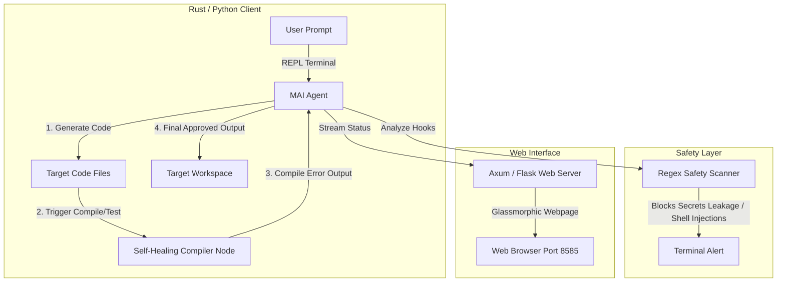

# 🤖 MAI CLI — Multi-Language Self-Healing AI Agent Workspace

Welcome to the **MAI CLI** project workspace. This workspace is a multi-language agent sandbox featuring a high-performance **Rust** edition and a legacy **Python** edition designed to compare execution speeds, memory usage, and concurrency paradigms.

---

## 📐 1. Architecture

The MAI CLI operates as a loop that integrates LLM reasoning with a local compiler and validation environment:



---

## 🔄 2. Workflow

1. **Prompt & Generation**: The user describes a code change request in the REPL interface.
2. **Self-Healing Loop**: The agent generates or modifies the target source file, then automatically triggers the corresponding local linter or compiler (e.g. `gcc`, `cargo check`, `pytest`, `eslint`, `node --check`):
   - **Success**: The code is saved, and status logs are written.
   - **Failure**: The linter/compiler stderr output is fed back into the agent's context window as a prompt extension, requesting a fix. This self-healing cycle runs up to 3 times before timing out.
3. **Security Check**: The output undergoes a regex security scan to block hardcoded API keys, shell injection commands (e.g., `subprocess(shell=True)`), or file destruction commands (`rm -rf`).
4. **Telemetry Dashboard**: All compilation cycles, healing history timelines, and token costs are pushed to an asynchronous web server and rendered on a modern glassmorphic dashboard webpage.

---

## 🛠️ 3. Tool Techstack

### Rust Edition (`agentic_ai_rs`) - Recommended
* **Runtime / Concurrency**: `tokio` (multi-threaded async runtime).
* **HTTP Client**: `reqwest` (API connections).
* **JSON Parsing**: `serde`, `serde_json`.
* **Dashboard Server**: `axum` / `hyper` web services.
* **Compilation**: Statically compiled binary requiring no local runtime engines.

### Python Edition (`agentic_ai_py`) - Legacy
* **Agent Engine**: `langgraph` (state orchestration graph), `langchain-openai`.
* **HTTP Connection**: `requests`, `urllib3`.
* **Dashboard Server**: `Flask` or `FastAPI`.
* **Environment**: Virtualenv python environment.

---

## 🗂️ 4. Project Structure

```
agentic_ai/
├── agentic_ai_rs/                 # High-performance Rust Edition
│   ├── src/
│   │   ├── bin/
│   │   │   ├── agent.rs           # Rust Agent CLI REPL main entry
│   │   │   └── dashboard.rs       # Axum web dashboard server
│   │   ├── lib.rs                 # Shared file operations, security scans & tools
│   │   └── main.rs                # Library entry wrapper
│   ├── Cargo.toml                 # Cargo dependencies configuration
│   └── README.md                  # Rust-specific details
├── agentic_ai_py/                 # Legacy Python Edition
│   ├── agent.py                   # Python LangGraph workflow agent
│   ├── dashboard.py               # Python Flask dashboard web server
│   ├── SKILL.md                   # Agent tools guidelines
│   └── requirements.txt           # Python dependency modules
├── performance_comparison.md      # Detailed benchmarks (Rust vs Python vs Go)
└── README.md                      # Workspace main documentation
```

---

## 🚀 5. How to Setup

### 1. Set Up Shell Aliases
To easily run both versions, add these execution aliases to your `~/.bashrc`:
```bash
# Rust Version (Recommended)
alias mai="/home/admin/project/agentic_ai/agentic_ai_rs/target/release/agent"
alias mai-rs="/home/admin/project/agentic_ai/agentic_ai_rs/target/release/agent"
alias mai-dashboard="/home/admin/project/agentic_ai/agentic_ai_rs/target/release/dashboard"

# Python Version (Legacy)
alias mai-py="/home/admin/project/agentic_ai/agentic_ai_py/venv/bin/python /home/admin/project/agentic_ai/agentic_ai_py/agent.py"
alias mai-py-dashboard="/home/admin/project/agentic_ai/agentic_ai_py/venv/bin/python /home/admin/project/agentic_ai/agentic_ai_py/dashboard.py"
```
Then refresh your terminal environment:
```bash
source ~/.bashrc
```

---

### 2. Rust Version Compilation
Navigate to the Rust crate and compile the release binaries:
```bash
cd agentic_ai_rs
cargo build --release
```
*   **Run CLI REPL**:
    ```bash
    mai-rs
    ```
*   **Run Web Dashboard Server**:
    ```bash
    mai-dashboard
    ```
    *Access the GUI at `http://127.0.0.1:8585`.*

---

### 3. Python Version Execution
Configure the virtual environment and launch:
```bash
cd agentic_ai_py
python3 -m venv venv
source venv/bin/activate
pip install -r requirements.txt
```
*   **Run CLI REPL**:
    ```bash
    mai-py
    ```
*   **Run Web Dashboard Server**:
    ```bash
    mai-py-dashboard
    ```
