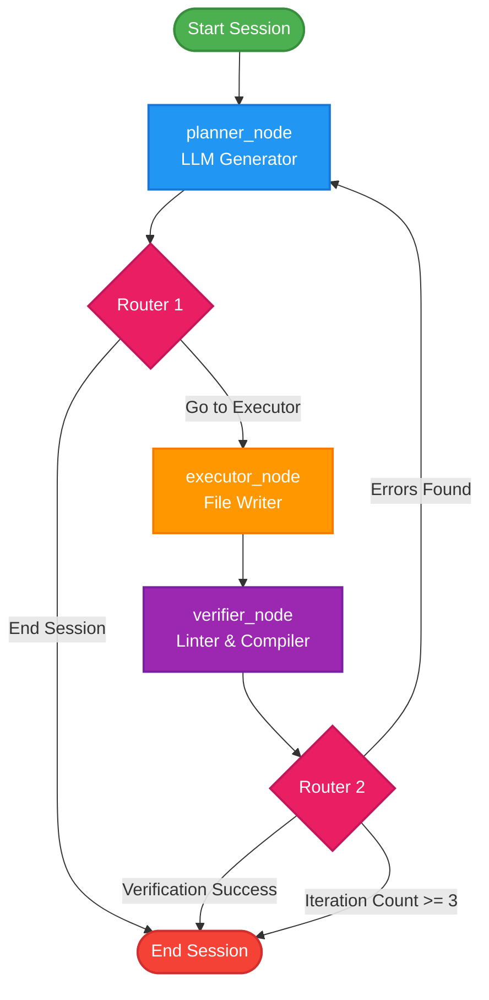

# 📂 MAI CLI Workspace Dashboard

Welcome to the **MAI CLI** project workspace! This workspace is optimized for **Obsidian**. By opening this folder as an Obsidian vault, you can easily manage the AI agent's rules, review execution logs, and navigate the project.

---

## 🧭 Quick Navigation
*   **Core Logic**: [[agent.py]] — LangGraph State Machine & CLI Loop
*   **Agent Guidelines**: [[SKILL.md]] — Dynamic System Instructions & Security Rules
*   **System Design**: [[docs/architecture.md]] — State Nodes, Edges, & Flow Details
*   **Interactive Prompts**: [[docs/custom_prompting.md]] — Test Cases & Validation Prompts
*   **Configuration**: [[test/.env]] — Gemini API Key setup
*   **System Diagram**: [[test/agent_graph.png]] — Visualized Agent Workflow

---

## 🏗️ Architecture Design
The agent utilizes a StateGraph to generate, execute, and verify source code files, loop-correcting errors automatically.



---

## 📋 Workspace Tasks & Milestones
- [x] Rename project to **MAI CLI**
- [x] Implement **JS Node.js Verification** in Verifier Node
- [x] Implement **Output Isolation** (`mai_output_YYYYMMDD_HHMMSS/`)
- [x] Implement **Dot Commands** alongside Slash Commands
- [x] Set up **Session Persistence** and history log output
- [x] Set up **CSS Validation** (braces checking)
- [x] Implement **Advanced Commands** (`.explain`, `.refactor`, `.add-test`)
- [x] Add **Advanced Security Checks** (Secrets detection, command injection, SQL injection)
- [x] Translate all prompts, CLI headers, and rules to English
- [x] Add more Linter integrations (e.g. ESLint, Flake8)

---

## ⚡ How to Run
Ensure your terminal session has loaded the latest alias:
```bash
source ~/.bashrc
mai
```
