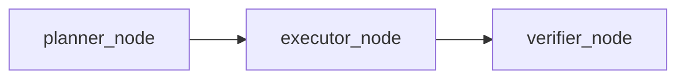

# 🏗️ MAI CLI Architecture Specifications

This document outlines the technical details and implementation flow of the **MAI CLI** agent.

---

## 💾 Agent State Schema
The state is managed using the `AgentState` struct, defined in [[src/bin/agent.rs]]:

| Variable Name | Type | Description |
| :--- | :--- | :--- |
| `messages` | `Sequence[BaseMessage]` | Conversational history (including system instructions, user inputs, and assistant JSON outputs). |
| `task_status` | `str` | Current verification/execution status: `"pending"`, `"executed"`, `"success"`, or `"failed"`. |
| `iteration_count`| `int` | Count of self-healing compile-retry loops (capped at 3). |
| `error_logs` | `str` | Logs of compile/lint/syntax errors fed back to the LLM for correction. |
| `generated_files` | `List[dict]` | Dictionary of paths and contents generated in the current turn. |
| `session_dir` | `str` | Subfolder name for isolating outputs: `mai_output_YYYYMMDD_HHMMSS/`. |

---

## ⚙️ LangGraph Nodes & Responsibilities

### 1. Planner Node (`planner_node`)
*   **Purpose**: Generates the required project files in a structured JSON schema (`ProjectOutput`).
*   **Instruction injection**: Dynamically reads [[SKILL.md]] rules and prepends them as system instructions for the LLM.
*   **Self-healing integration**: If `error_logs` exist in the state, it appends them to the prompt, instructing the LLM to patch the issues.

### 2. Executor Node (`executor_node`)
*   **Purpose**: Parses the structured JSON returned by the planner, extracts files, and writes them into the local session directory.
*   **Isolation**: Creates subfolders dynamically if they do not exist.

### 3. Verifier Node (`verifier_node`)
*   **Purpose**: Validates all generated files before completing the run.
*   **Validation Rules**:
    *   **Security check**: Scrutinizes files using regular expression filters.
    *   **Python (`.py`)**: Checks compilation and executes the script. If `ModuleNotFoundError` is caught, attempts `pip install` automatically.
    *   **JavaScript (`.js`)**: Executes the file via `node` interpreter.
    *   **HTML/XML (`.html`, `.xml`)**: Validates tag nesting via `HTMLParser`.
    *   **CSS (`.css`)**: Verifies braces balance `{}`.
    *   **JSON (`.json`)**: Validates file structure using `json.loads()`.

---

## 🔒 Security Guardrails
The system blocks the writing of any code that contains:
1.  **File deletion triggers**: `os.remove`, `os.rmdir`, `shutil.rmtree`.
2.  **Unsafe shell execution**: `subprocess.run(..., shell=True)` (risk of command injection).
3.  **SQL dynamic interpolation**: `execute(f"SELECT ... {var}")` (risk of SQL Injection).
4.  **Hardcoded credentials**: Gemini API key formats (`AIzaSy...`) or general variable assignments containing raw API keys/passwords.
